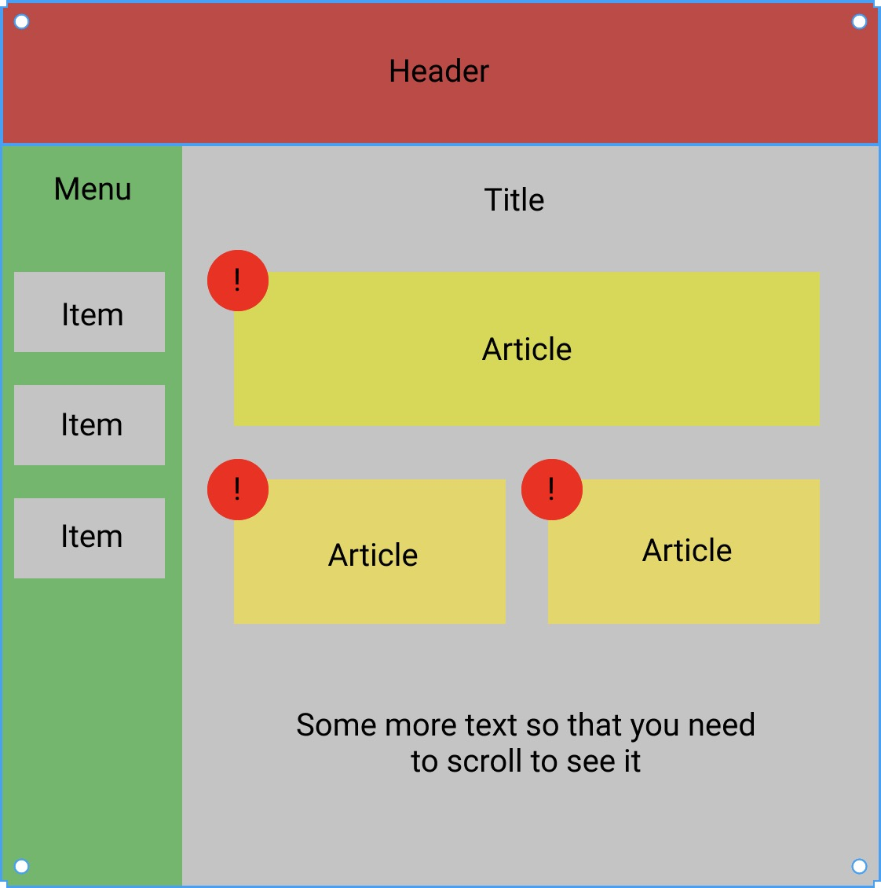

# React-MIPT
 

## Домашние задания
### **ДЗ 1** - deadline 23:59 19.02
Сверстать макет, прикрепленный ниже. Header и Menu должны всега присутствовать на экране и не двигаться при прокрутке. Все цвета, отступы и тд выбираете сами, макет примерный.
Для сдачи задания нужно отправить письмо на valery.statinov@gmail.com, указав тему письма «React МФТИ ДЗ_1» без ковычек, приложить к письму два файла: .html и .css.

\+ Настоить рабочее окружение (установить `NodeJS`) и попробовать создать Hello world проект с помощью `npx create-react-app project-name`. `npm` и `npx` появятся после установки `NodeJS`.